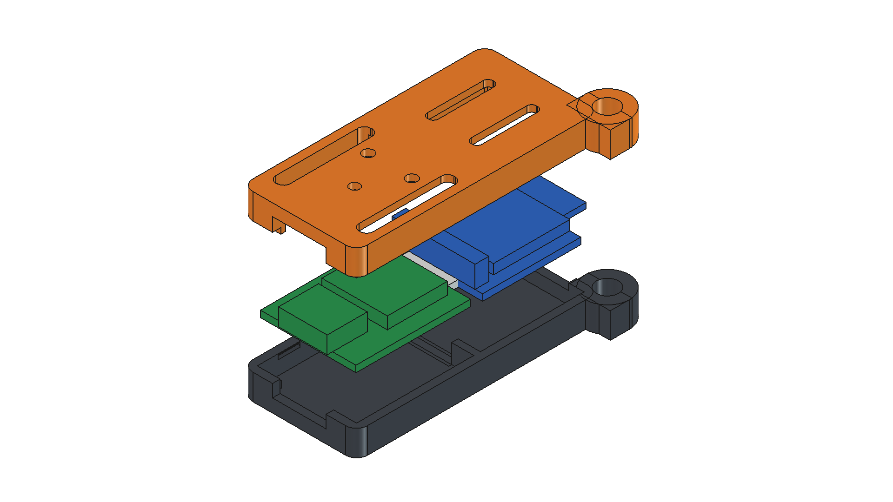
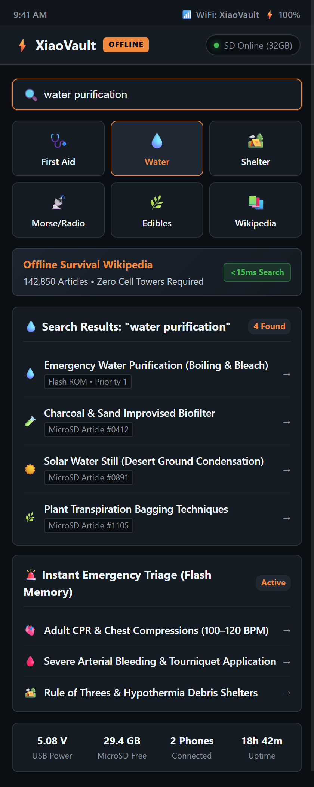
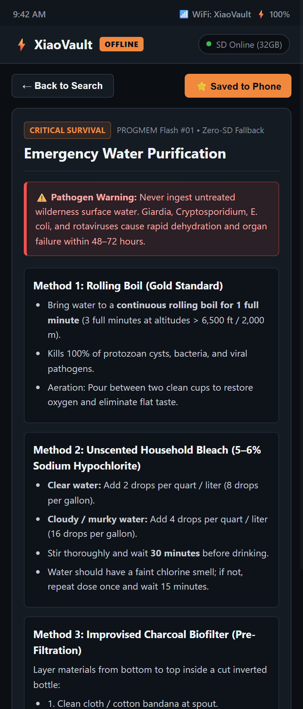

# ⚡ XiaoVault Survival Wiki

[](LICENSE)
[](https://everyday3d.github.io/xiaovault-survival-wiki/)
[](https://platformio.org/)
[](https://www.seeedstudio.com/Seeed-Studio-XIAO-ESP32C6-p-5884.html)
[](models/)

> **A pocket-sized, self-hosted offline emergency knowledge base & Wikipedia micro-server running on the Seeed Studio XIAO ESP32-C6.**

When cellular towers, power grids, and internet access go down during emergencies, natural disasters, or remote off-grid expeditions, **XiaoVault Survival Wiki** provides instant, portable access to medical guides, survival manuals, and the entirety of human knowledge right on your smartphone or laptop.

---

## 📸 3D Printable Snap-Fit Case (XiaoVault C6 Tandem Edition)

This repository includes the complete 3D printable **XiaoVault C6 Tandem Edition** zero-support snap-fit enclosure files in [`models/`](models/):



### Key Enclosure Features:
- **End-to-End Tandem Architecture**: Houses both the Seeed Studio XIAO ESP32-C6 and a standard 6-pin MicroSD SPI Breakout board while maintaining an ultra-slim 9.4 mm pocket profile (21.0 mm W × 44.5 mm L × 9.4 mm H).
- **Rear Push-Push MicroSD Ejection Slot**: Swap or update survival databases on your MicroSD card on the fly through the dedicated rear slot without opening the case.
- **Front Split U-Notch USB-C Port**: Plug in any standard USB cable or portable phone charger power bank with zero cable strain.
- **8-Point Positive Click-Lock Detents**: 4 cantilever detents per side ensure a tight, rattle-free seal that will never loosen in a backpack or pocket.
- **100% Zero-Support FDM Printability**: Pre-oriented flat on print bed with 0 downward-facing steep overhangs.
- **Integrated 4.0 mm Paracord / Keyring Loop**: Heavy-duty lanyard loop on the rear corner.
- **Open CAD for Customization (STEP & FreeCAD)**: Includes universal STEP solids (`.step`) and the master parametric FreeCAD project (`.FCStd`) so you can easily remix, adapt dimensions to other breakout modules, or add custom mounting tabs.

---

## 📱 Web Interface & Offline Mobile Experience

Connecting to the `XiaoVault Survival Wiki` WiFi hotspot automatically triggers your smartphone's native captive portal, launching a lightweight, zero-dependency dark-mode web application directly in your browser. **No apps, no internet connection, and no accounts required.**

<div align="center">

| 🔍 Search & Category Hub | 📖 Emergency Article Reader |
| :---: | :---: |
|  |  |

</div>

### Interface Highlights:
- **⚡ Sub-15ms Binary Search**: Instant article filtering over the MicroSD index as you type across hundreds of thousands of survival articles and Wikipedia entries.
- **🚨 Fail-Safe Flash Triage**: Essential life-saving protocols (CPR, Tourniquets, Water Purification, Rule of Threes) boot directly from microcontroller flash memory (`PROGMEM`) even if the MicroSD card is removed.
- **🔋 Live Hardware Telemetry**: The bottom status dock monitors real-time USB-C power bank input voltage, MicroSD storage capacity, connected reader count, and device uptime.
- **⭐ Local Phone Bookmarks**: Save critical guides directly to your phone's browser cache for offline reference even if you step away from the device.
- **🖤 Battery-Optimized OLED Dark Theme**: Ultra-lean payload (<15 KB total) designed for maximum battery conservation and high-contrast sunlight readability.

---

## 🌟 Key Features

* 📡 **Offline WiFi Hotspot & Instant Captive Portal**: The ESP32-C6 broadcasts its own standalone WiFi access point (`XiaoVault Survival Wiki`). When any phone connects, the browser automatically launches the search engine and reader. **Zero apps, zero cell towers, zero internet required.**
* ⚡ **High-Speed Micro-Wiki Binary Search**: Custom binary index algorithm searches through hundreds of thousands of articles on a MicroSD card in **less than 15 milliseconds** over SPI.
* 🚨 **Fail-Safe Flash Emergency Guides**: Even if your MicroSD card is lost, removed, or corrupted, life-saving emergency cheat sheets (Adult CPR, Tourniquet Application, Water Purification, Rule of Threes, and Morse Code) boot instantly directly from microcontroller flash memory (`PROGMEM`).
* 🔋 **Powered by Portable Phone Chargers (Zero Soldering!)**: Plug any standard USB-C power bank directly into the case. A compact 10,000mAh power bank provides **4+ days (90–100 hours)** of continuous, nonstop offline access. Includes smart keep-alive pulses to prevent power banks from auto-shutting off.
* 📱 **Ultra-Lightweight Dark-Mode Web App**: High-contrast, battery-saving dark interface (<15 KB) with instant search autocomplete, category filtering, and offline bookmarks saved to the phone's local storage.
* 🖨️ **100% Zero-Support Snap Enclosure**: Includes precision snap-fit CAD models with dual GPIO pin slots and an integrated 4.0 mm keyring fail-safe lock.

---

## 🏗️ System Architecture

```
                       +---------------------------------------+
                       |        Your Smartphone / Laptop       |
                       | (iOS, Android, Windows, Mac, Linux)   |
                       +---------------------------------------+
                                          ▲
                                          │ 📡 Local WiFi 6 (802.11 b/g/n/ax)
                                          │    SSID: "XiaoVault Survival Wiki"
                                          ▼
+---------------------------------------------------------------------------------+
|  Seeed Studio XIAO ESP32-C6 (160 MHz RISC-V)                                     |
|                                                                                 |
|  +--------------------+     +---------------------+     +--------------------+  |
|  | Captive Portal DNS |     | Lightweight Web Svr |     | Power Manager      |  |
|  | Port 53 (* -> AP)  |     | Port 80 (JSON & UI) |     | ADC Battery Sense  |  |
|  +--------------------+     +---------------------+     +--------------------+  |
|                                        │                                        |
|  +-------------------------------------+-------------------------------------+  |
|  | WikiEngine (Binary Search Parser & Flash Emergency Guide Fallback)        |  |
|  +-------------------------------------+-------------------------------------+  |
|                                        │ SPI Bus (25 MHz)                       |
+----------------------------------------+----------------------------------------+
                                         ▼
                 +-----------------------------------------------+
                 |  FAT32 / exFAT MicroSD Card (32GB – 128GB)    |
                 |  - /wiki/wiki.idx (High-speed binary index)   |
                 |  - /wiki/wiki.dat (Compressed article bodies) |
                 |  - /guides/       (Raw Markdown & HTML files) |
                 +-----------------------------------------------+
```

---

## 🚀 Quick Start Guide

### 1. Flash the Firmware

#### ⚡ Option A: 1-Click Browser Web Flasher (Zero Software Installation!)
You don't need PlatformIO, Python, or Arduino IDE installed. Plug your **Seeed Studio XIAO ESP32-C6** into your computer via USB-C and flash directly from Chrome, Edge, or Brave:

👉 **[Launch XiaoVault 1-Click Web Flasher](https://everyday3d.github.io/xiaovault-survival-wiki/)**

1. Connect your Xiao via USB-C data cable.
2. Click **⚡ Connect & Flash XiaoVault**.
3. Pick your Xiao COM port from the browser prompt. Flashing and verification take ~25 seconds!

---

#### Option B: Using PlatformIO (For Developers)
```bash
# Clone the repository
git clone https://github.com/everyday3d/xiaovault-survival-wiki.git
cd xiaovault-survival-wiki

# Build and flash to Seeed Studio XIAO ESP32-C6
pio run -e seeed_xiao_esp32c6 -t upload

# Open serial monitor
pio device monitor -b 115200
```

#### Option C: Using Arduino IDE
1. Install the **ESP32** board package in the Arduino Boards Manager.
2. Select Board: **ESP32C6 Dev Module** (or Seeed Studio XIAO ESP32C6).
3. Install the **ArduinoJson** library (v7.x) via Library Manager.
4. Open [`src/main.cpp`](src/main.cpp) as a sketch and click **Upload**.

---

### 2. Prepare Your MicroSD Card

1. Format a MicroSD card (32GB or 64GB) as **FAT32** or **exFAT**.
2. Run the included Python tool to compile your survival guides or Wikipedia dumps into the high-speed index:
   ```bash
   cd tools
   python build_wiki_sd.py --create-samples
   ```
3. Copy the generated `wiki` folder directly onto the root of your MicroSD card:
   ```text
   MicroSD Card Root (D:\)
   └── wiki/
       ├── wiki.idx   (Binary Search Index)
       └── wiki.dat   (Article Content Data)
   ```
4. Insert the card into your MicroSD breakout board attached to the XIAO.

---

### 3. Connect and Read

1. Power on your XiaoVault device (via USB-C or attached LiPo battery).
2. On your phone or laptop, open your WiFi settings and connect to:
   * **Network Name (SSID)**: `XiaoVault Survival Wiki`
   * **Password**: *(None — Open network by default)*
3. A captive portal prompt will automatically appear! If it doesn't open automatically, open any browser and navigate to:
   ```text
   http://192.168.4.1/
   ```
4. Search, browse survival categories, and read offline guides!

---

## 📌 Wiring Diagram

Connect your MicroSD SPI card breakout to the Seeed Studio XIAO ESP32-C6 as follows:

| XIAO Pin Label | ESP32-C6 GPIO | MicroSD Module Pin | Description | Wire Color (Typical) |
| :--- | :--- | :--- | :--- | :--- |
| **3V3** | 3.3V Power | **VCC** | 3.3V Power Supply | Red |
| **GND** | Ground | **GND** | Ground | Black |
| **D8** | `GPIO 19` | **SCK / CLK** | SPI Clock | Yellow |
| **D9** | `GPIO 20` | **MISO / DO** | SPI Data Out | Green |
| **D10** | `GPIO 18` | **MOSI / DI** | SPI Data In | Blue |
| **D2** | `GPIO 2` | **CS** | Chip Select | White |

For detailed battery and voltage divider wiring, see [`docs/WIRING.md`](docs/WIRING.md).

---

## 🧰 Hardware Bill of Materials (BOM)

* **Microcontroller**: [Seeed Studio XIAO ESP32-C6](https://www.amazon.com/dp/B0D2NKVB34) (~$5.20)
* **Storage**: 32GB or 64GB MicroSD Card (~$6.00)
* **SD Breakout**: 3.3V MicroSD Card SPI Module (~$1.50)
* **Power Source**: Any Standard **Portable Phone Charger / USB Power Bank** (5,000–10,000mAh) or solar charger
* **Case**: 3D Printed **XiaoVault C6** Snap Enclosure (Included in [`models/`](models/))

See [`docs/HARDWARE.md`](docs/HARDWARE.md) for full component links.

---

## 📜 License

This project is licensed under the **MIT License** — see the [`LICENSE`](LICENSE) file for details.

Developed with 🐾 for makers, hikers, and emergency preparedness by **everyday3d / BoxerDawg 3D**.
